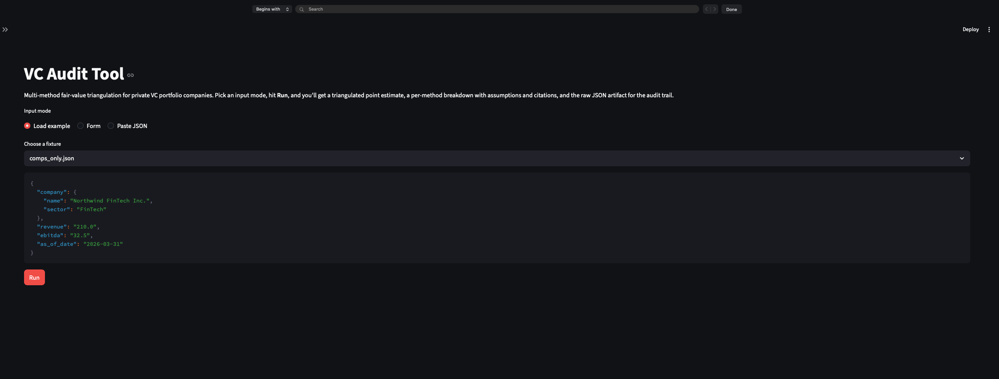

# VC Audit Tool

**Thesis:** the interesting problem isn't picking *the* valuation method — it's reconciling several into a defensible point estimate. This tool runs the three textbook approaches (Comparable Company Analysis, Discounted Cash Flow, Last Round Market-Adjusted) behind a single strategy interface, then **triangulates** them into a confidence-weighted point, a min/max range, a dispersion flag, and per-method outlier detection. Output is a JSON + Markdown artifact that traces every number back to its inputs, sources, and assumptions.

The framing follows [ASC 820 Level 3 fair-value measurement][asc820-l3], which **explicitly endorses combining methods rather than picking one**: per [ASC 820-10-35-24B][asc820-24b], "in some cases a single valuation technique will be appropriate... [but] when there is no quoted price in an active market, it is sometimes appropriate for an entity to use multiple valuation techniques," and the entity is "required to evaluate the results... of all techniques and weigh them, as appropriate." That second clause is the formal grounding for the triangulator's confidence-weighted reconciliation. The three methods are deliberately the standard trio — they're the substrate for the interesting layer, which is the engine.

## What the engine does

The `Triangulator`:
- asks each method `is_applicable(request)` so missing inputs don't kill the run,
- normalizes per-method confidence into weights,
- computes `point = Σ wᵢ × pointᵢ`, `range = (min(lowᵢ), max(highᵢ))`,
- flags `dispersion = (high − low) / point > 0.5`,
- names the **outlier** method (>2× or <0.5× the median across applicable methods),
- accepts `request.method_weights` so auditor judgment is a typed, validated input — not a footnote.

Confidence is per-method, derived from the data: DCF scales with horizon coverage × completeness; Last Round decays exponentially with round age (zero at 2 years); Comps scales with peer count. Auditors see *why* a method is weighted heavily.

## The three methods

| Method | Inputs | High-confidence when |
|---|---|---|
| **Comps** | sector, revenue (and/or EBITDA) | many sector peers; the company's metric is "covered" by the peer cluster |
| **DCF** | 1–5y projections, discount rate, terminal growth, tax rate | long horizon (≥3y), complete line items, `g < r` |
| **Last Round** | last post-money valuation, round date, market index | recent round (<12 months); confidence decays after that |

DCF reports its range using a 3×3 **sensitivity grid** over the two most consequential inputs (discount rate ± 1pp × terminal growth ± 0.5pp); cells violating Gordon stability are skipped and counted in the assumption rationale.

## Architecture and request flow
```
┌──────────────────────────────────────────────────────────────┐    ValuationRequest
│  Presentation                                                │          │
│  ┌────────────────┐  ┌────────────────┐  ┌────────────────┐  │          ▼
│  │  CLI (Typer)   │  │ FastAPI server │  │ Streamlit UI   │  │    ┌──────────────┐
│  └───────┬────────┘  └───────┬────────┘  └───────┬────────┘  │    │ Triangulator │── for each registered method:
│          │                   │                   │           │    └──────┬───────┘     ├─ method.is_applicable(request)?
└──────────┼───────────────────┼───────────────────┼───────────┘           │             ├─ if yes, method.value(request) → MethodResult
           │                   │                   │                       │             └─ if no,  SkippedMethod(name, reason) [audit log]
┌──────────▼───────────────────▼───────────────────▼───────────┐           │
│  Engine                                                      │           │ MethodResult[]   (+ SkippedMethod[] carried forward)
│  ┌────────────────────────────────────────────────────────┐  │           ▼
│  │                    Triangulator                        │  │    ┌────────────────────────┐
│  │  • partitions methods into applicable / skipped        │  │    │ Compute weights:       │
│  │    (skipped methods carry a reason for the audit log)  │  │    │  raw_confidence_i      │
│  │  • collects MethodResult[] from the applicable subset  │  │    │  / Σ raw_confidence    │
│  │  • normalizes confidences → weights                    │  │    │ (or override if given) │
│  │  • applies auditor weight overrides if supplied        │  │    └──────────┬─────────────┘
│  │  • computes point (weighted avg), range (min/max),     │  │               │
│  │    dispersion ((high-low)/point)                       │  │               ▼
│  │  • detects per-method outliers (>2× or <0.5× median)   │  │    ┌─────────────────────────────────────┐
│  └────────────────────────────────────────────────────────┘  │    │ Synthesize:                         │
└──────────────────────────────┬───────────────────────────────┘    │  point    = Σ w_i × point_i         │
                               │                                    │  low      = min(low_i)              │
┌──────────────────────────────▼───────────────────────────────┐    │  high     = max(high_i)             │
│  Methods (strategy pattern, ValuationMethod ABC)             │    │  disp     = (high − low) / point    │
│  ┌──────────────┐  ┌──────────────┐  ┌──────────────┐        │    │  outliers = methods >2× or <0.5×    │
│  │ CompsMethod  │  │ DCFMethod    │  │ LastRound    │        │    │             median across results   │
│  │              │  │ (3×3 grid)   │  │ Method       │        │    └──────────┬──────────────────────────┘
│  └──────┬───────┘  └──────────────┘  └──────┬───────┘        │               │
└─────────┼─────────────────────────────────── ┼───────────────┘               ▼
          │                                    │                        TriangulatedValuation
┌─────────▼────────────────────────────────────▼───────────────┐        (includes method_results, skipped_methods,
│  Data providers (Protocol + mock impls)                      │         weights, dispersion, outliers, echoed request)
│  ┌──────────────────┐         ┌────────────────────────┐     │                   │
│  │ CompsProvider    │         │ MarketIndexProvider    │     │           ┌───────┴────────┐
│  │ (mock universe)  │         │ (mock NASDAQ history)  │     │           ▼                ▼
│  └──────────────────┘         └────────────────────────┘     │       JSON report    Markdown report
└──────────────────────────────────────────────────────────────┘

┌──────────────────────────────────────────────────────────────┐
│  Output                                                      │
│  ┌────────────────────┐    ┌────────────────────────────┐    │
│  │ JSON report writer │    │ Markdown report writer     │    │
│  └────────────────────┘    └────────────────────────────┘    │
└──────────────────────────────────────────────────────────────┘
```
## Quickstart
```bash
make install                    # uv sync
make check                      # ruff + format-check + mypy --strict + pytest (169 tests)
make dev                        # FastAPI on :8000 — see /docs for OpenAPI
make ui                         # Streamlit demo on :8501 (uv sync --extra ui first)
make examples                   # regenerate examples/outputs/ from examples/inputs/
```

**Where to start as a reviewer:** open [`examples/outputs/full.md`](examples/outputs/full.md) for what the tool produces, then [`src/vc_audit/engine/triangulator.py`](src/vc_audit/engine/triangulator.py) for how.

## Using the tool

**CLI** — one command per format, or `both` to write into a directory:

```bash
uv run vc-audit example | uv run vc-audit value -i /dev/stdin --format markdown
uv run vc-audit value -i examples/inputs/full.json --format both -o examples/outputs/
```

**API** — `POST /valuations` with a `ValuationRequest` JSON body; supports `?format=json|markdown|both`. `/methods` lists registered methods and their applicability rules; `/health` is a 200 ok. Live OpenAPI at `localhost:8000/docs`.

**UI** — `make ui` opens a Streamlit page with three input modes (load a bundled fixture, fill a structured form, or paste JSON). Renders the markdown report and raw JSON side-by-side.



## Key design decisions

- **Triangulation over single-method.** Codified in ASC 820-10-35-24B (see Sources). Dispersion + outlier flags surface exactly the cases that need auditor judgment.
- **Range = elementwise min/max, not a weighted envelope.** Auditors care about the worst-case spread, not a smoothed band.
- **Outlier detection complements `dispersion_flag`.** The flag answers "is there disagreement?"; the outlier list answers "*which* method?".
- **DCF range from a 3×3 sensitivity grid**, not a hardcoded ±N% factor. The grid reflects sensitivity to the two most consequential inputs.
- **`Decimal` everywhere** for money and rates. No float arithmetic touches a valuation number.
- **Providers behind a `Protocol`.** Mock impls ship; real ones drop into `build_default_triangulator()` without engine changes.
- **Auditor weight overrides** (`request.method_weights`) are first-class — typed, validated, echoed in the audit trail.

## Sources & references

**Primary standards (US GAAP):**
- [ASC 820-10-35-24B][asc820-24b] — endorses use of multiple valuation techniques when no quoted price exists in an active market, and requires the entity to weigh their results. *Verified verbatim via Deloitte DART codification, May 2026.*
- [ASC 820 fair-value hierarchy (Level 1/2/3)][asc820-l3] — private portfolio companies fall under Level 3 (unobservable inputs); the framing for why audit traceability is the dominant non-functional requirement of this tool.

**Industry guidance:**
- [IPEV Valuation Guidelines (Dec 2025)][ipev] — the global VC/PE-specific standard, aligned with ASC 820 and IFRS 13. Recommended reading for context on Level 3 venture practice.
- [AICPA *Accounting and Valuation Guide: Valuation of Privately-Held-Company Equity Securities Issued as Compensation*][aicpa-cheap-stock] — defines OPM Backsolve, PWERM, and Hybrid methods (cited under "What I'd do next").

**Technical references:**
- US 21% corporate tax rate (default in `ValuationRequest.tax_rate`): [Internal Revenue Code §11][irc-11] (post-TCJA 2017).
- `Decimal` over `float` for monetary arithmetic: [IEEE 754][ieee754] / Goldberg, ["What Every Computer Scientist Should Know About Floating-Point Arithmetic"][goldberg-1991] (1991).
- Gordon Growth Model (DCF terminal value, requires `g < r`): Gordon, M.J., ["Dividends, Earnings, and Stock Prices"][gordon-1959] (1959).

## What I'd do next

- Real provider integrations (Yahoo Finance / FRED / a peer-comp source) replacing the mocks.
- **Calibration check** (ASC 820 concept): given a recent observable transaction, recalibrate model multiples to match — quantifies method bias.
- **OPM Backsolve** as a fourth method for capital-structure-aware allocation across share classes.
- Per-sector calibration of the dispersion threshold (currently a global 0.5 heuristic).
- Content-addressed report store: hash request + engine version → cache-immutable output.
- Run history + scenario diffing ("what changed between Q3 and Q4?").
- Property-based tests for triangulator invariants (`range_low ≤ point ≤ range_high`; weights sum to 1.0).

See `PLAN.md` for the full design rationale and `discussion.md` for per-decision notes.

[asc820-l3]: https://viewpoint.pwc.com/dt/us/en/pwc/accounting_guides/fair_value_measureme/fair_value_measureme__9_US/chapter_1_introducti__1_US/15_key_concepts_in_a_US.html
[asc820-24b]: https://dart.deloitte.com/USDART/home/codification/broad-transactions/asc820-10/roadmap-fair-value-measurements-disclosures/chapter-10-subsequent-measurement/10-3-valuation-techniques
[ipev]: https://www.privateequityvaluation.com/Portals/0/Documents/Guidelines/2025%20IPEV%20Valuation%20Guidelines.pdf
[aicpa-cheap-stock]: https://www.aicpa-cima.com/cpe-learning/publication/valuation-of-privately-held-company-equity-securities-issued-as-compensation-accounting-and-valuation-guide-OPL
[irc-11]: https://www.law.cornell.edu/uscode/text/26/11
[ieee754]: https://en.wikipedia.org/wiki/IEEE_754
[goldberg-1991]: https://docs.oracle.com/cd/E19957-01/806-3568/ncg_goldberg.html
[gordon-1959]: https://www.jstor.org/stable/1927792
